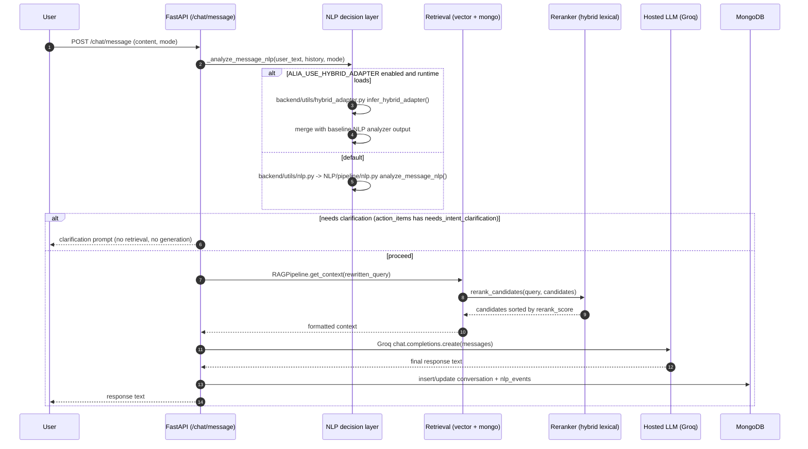
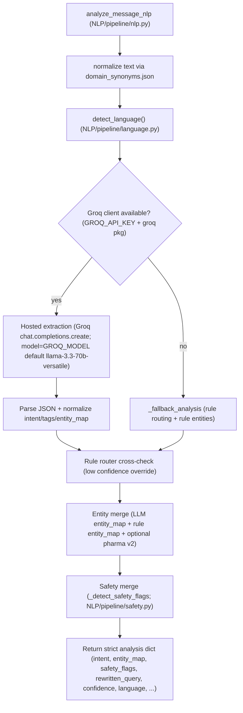
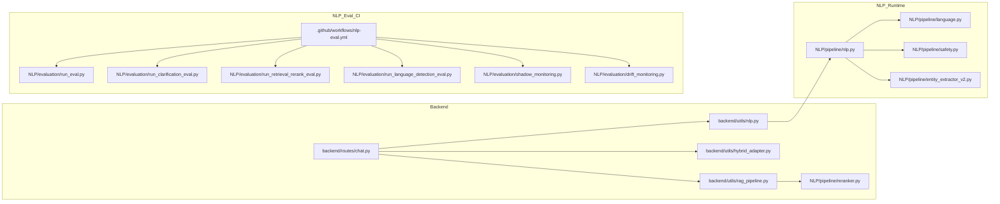
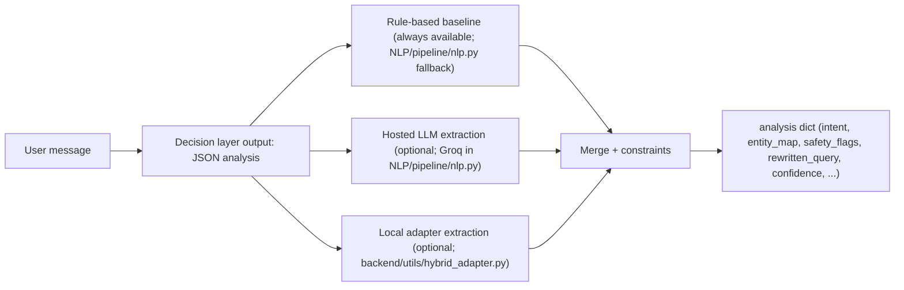

# ALIA NLP — Diagrams (Repo-Truth)

This file contains **Mermaid diagrams** that are generated strictly from what exists in the repository.  
If your PDF viewer can’t render Mermaid, these diagrams still serve as **executable architecture source**.

---

## 1) Core runtime sequence (end-to-end, real code)

**Evidence**:
- Request handler + orchestration: `backend/routes/chat.py`
- Baseline NLP analyzer: `backend/utils/nlp.py` → `NLP/pipeline/nlp.py`
- Optional hybrid adapter: `backend/utils/hybrid_adapter.py` and `ALIA_USE_HYBRID_ADAPTER` gate in `backend/routes/chat.py`
- RAG + rerank call: `backend/utils/rag_pipeline.py` → `NLP/pipeline/reranker.py`

---

## 2) NLP-only runtime flow (inside `NLP/pipeline/nlp.py`)

---

## 3) Dependency map (NLP + backend call graph)

---

## 4) “Three NLP engines” position diagram (truthful)

