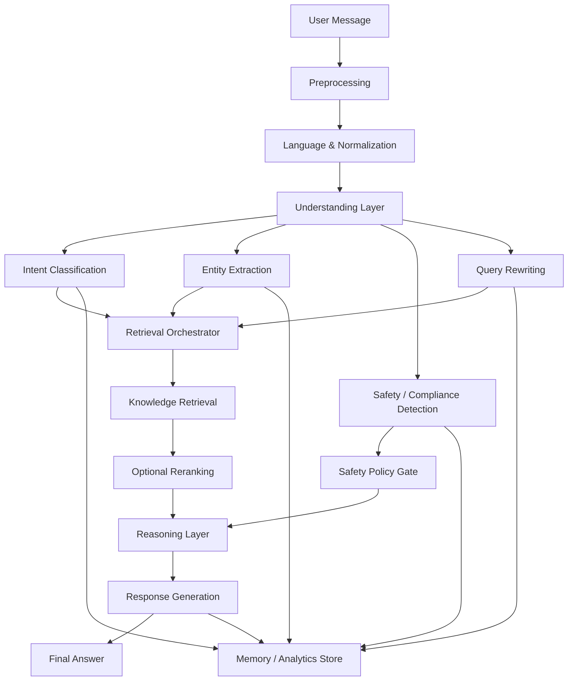

# Advanced NLP Architecture for ALIA Web

This document defines the NLP target architecture for the project: what the system should do, how data flows through it, and how to evolve it from the current LLM-assisted implementation into a full-fledged NLP platform.

## 1. NLP Goal

The NLP layer should not only generate responses. It should:

- understand user intent
- extract domain entities
- detect safety and compliance risk
- rewrite queries for retrieval
- support conversation memory and analytics
- provide measurable, testable outputs

For this project, NLP is the decision layer that sits between user input and response generation.

## 2. Target Architecture



## 3. Core Layers

### 3.1 Input Layer

Input to the NLP system should include:

- current user message
- recent conversation history
- current mode or role context
- retrieved knowledge snippets
- optional metadata such as language, user role, and session status

### 3.2 Preprocessing Layer

Responsibilities:

- normalize text
- detect language
- expand abbreviations and synonyms
- remove noise and formatting artifacts
- optionally detect PII or sensitive medical content

### 3.3 Understanding Layer

This is the main NLP layer. It should produce structured outputs:

- intent
- entities
- topics
- objections
- safety flags
- rewritten query
- confidence score

This layer can start with LLM-based extraction, then later be upgraded to hybrid or trained models.

### 3.4 Retrieval Layer

Responsibilities:

- rewrite the query for semantic search
- search product vectors
- search knowledge document vectors
- optionally search past conversations
- rerank results by relevance

### 3.5 Reasoning Layer

Responsibilities:

- determine whether to answer, clarify, or refuse
- merge retrieval results with conversation context
- apply medical safety policy rules
- construct the final prompt for generation

### 3.6 Generation Layer

Responsibilities:

- produce the final response
- keep it grounded in retrieved evidence
- enforce tone and policy by mode
- avoid patient-specific medical advice when required

### 3.7 Memory and Analytics Layer

Store NLP outputs for:

- per-message analytics
- session-level summaries
- safety trends
- low-confidence analysis
- retrieval quality monitoring

## 4. Recommended Internal Services

Split the system into four logical services:

### NLP Orchestrator

Routes each message through preprocessing, intent detection, entity extraction, safety checks, and query rewriting.

### Retrieval Service

Handles vector search, reranking, and knowledge selection.

### Safety Service

Applies compliance rules, patient-specific advice detection, and refusal logic.

### Generation Service

Builds the final LLM prompt and returns the answer.

## 5. Current State vs Target State

### Current state

- LLM-assisted intent/entity/safety extraction
- query rewriting for RAG
- stored NLP events per message
- debug endpoint for inspection
- session filters for intent and safety flags

### Target state

- hybrid rule + model extraction
- dedicated intent and NER evaluation sets
- retriever reranking
- multilingual handling
- stronger safety taxonomy
- monitoring and drift detection
- trained or fine-tuned classifiers for stable tasks

## 6. Data Contract

Each NLP analysis should return a strict schema similar to:

```json
{
  "intent": "safety_question",
  "entities": ["renal impairment", "Product X"],
  "topics": ["dosage", "contraindications"],
  "objections": [],
  "action_items": ["check label", "consult specialist"],
  "safety_flags": ["patient_specific_advice_request"],
  "rewritten_query": "Product X renal impairment dosage contraindications",
  "confidence": 0.91
}
```

## 7. Build Plan

### Phase 1: Foundation

- finalize intent taxonomy
- finalize safety flags
- keep strict JSON output
- persist NLP results per message
- add debug endpoint
- add structured logging

### Phase 2: Quality

- create a labeled test set
- measure intent accuracy
- measure entity extraction quality
- measure safety recall
- improve query rewriting
- add query reranking

### Phase 3: Production-Grade NLP

- add domain dictionary and synonym normalization
- add multilingual support
- add monitoring dashboards
- add low-confidence and high-risk review flows
- add retriever and generation regression tests

### Phase 4: Full-Fledged NLP

- train or fine-tune intent classifier
- train domain entity extraction model
- train reranker for retrieval quality
- add drift detection and retraining triggers
- version prompts, models, and taxonomy

## 8. Suggested API Endpoints

- `POST /chat/message` - main chat flow with NLP + RAG
- `POST /chat/nlp-debug` - inspect NLP output for a sample message
- `GET /chat/sessions` - list sessions with NLP summaries and filters
- `GET /chat/sessions/{id}` - full conversation detail with NLP history

## 9. Success Metrics

Track these metrics to know when the NLP is improving:

- intent accuracy
- entity precision and recall
- safety recall
- retrieval hit rate
- answer groundedness
- low-confidence rate
- fallback rate
- user follow-up rate

## 10. What Makes It "Advanced"

The system becomes advanced when it is not just generating text, but reliably:

- understands intent
- extracts domain facts
- controls safety
- improves retrieval
- keeps memory and analytics
- is measurable and testable

## 11. What Makes It "Full-Fledged"

The NLP becomes full-fledged when it has:

- a stable schema
- a labeled evaluation dataset
- trained or fine-tuned components where needed
- multilingual support
- monitoring and drift detection
- clear versioning of prompts and models
- a human review path for edge cases

## 12. Practical Recommendation

For this project, the best approach is hybrid:

- keep the LLM for flexible extraction and rewriting
- add deterministic rules for safety and known domain terms
- add evaluation and analytics immediately
- later replace the weakest pieces with trained models

That gives you an advanced NLP stack without over-engineering too early.
