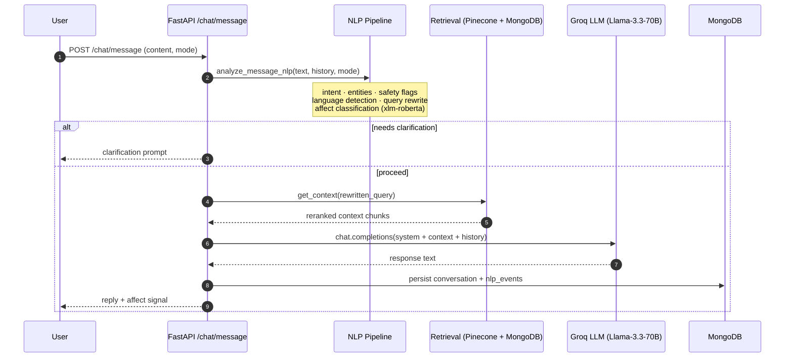

# ALIA — Pharmaceutical AI Assistant

ALIA is a conversational AI platform for pharmaceutical sales training and clinical knowledge retrieval. It serves as an intelligent agent that operates in two distinct roles — simulating a doctor to train medical representatives, or simulating a medical rep to assist doctors with product knowledge:

- **MedRep** — simulates a physician interaction to train medical sales representatives, evaluating competency and communication quality.
- **Physician** — provides a clinical knowledge portal for answering drug-related questions, backed by RAG over a pharmaceutical knowledge base.

---

## Architecture



### NLP Pipeline — layer breakdown

| Layer | Purpose | Engine |
|---|---|---|
| L1 Language detection | Detect fr / ar / en | langdetect |
| L2 Intent classification | Route query to intent class | Rule-based → Groq → QLoRA adapter |
| L3 Entity extraction | Products, molecules, dosages, indications | Lexicon + fuzzy match |
| L4 Safety flags | Compliance / off-label / dosage risk detection | Rule-based |
| L5 Clarification | Ask follow-up when intent is ambiguous | Rule-based + threshold |
| L6 Scoring / explainability | Confidence, evidence trail | Weighted aggregation |
| L7 Affect | Emotion/sentiment from text or audio | xlm-roberta-base / wav2vec2 |

Inference falls through a **3-tier fallback chain**: local QLoRA adapter → Groq cloud → rule-based baseline.

---

## Tech Stack

| Layer | Technology |
|---|---|
| Frontend | React 19, Vite, React Router, Three.js, Auth0 |
| Backend | FastAPI 0.115, Python 3.11, Uvicorn |
| NLP | Transformers, PEFT/QLoRA, SpeechBrain, sentence-transformers |
| LLM | Groq (Llama-3.3-70B-Versatile) |
| Vector DB | Pinecone |
| Databases | MongoDB 7 (Motor async), Redis 7 |
| Auth | JWT (local) + Auth0 (OAuth) |
| Deployment | Docker, Docker Compose |
| CI | GitHub Actions — NLP quality gates + Docker build + smoke test |

---

## Quick Start

### Requirements
- Docker ≥ 24 with Docker Compose V2
- A [Groq](https://console.groq.com) API key
- A [Pinecone](https://app.pinecone.io) API key (index name: `alia-knowledge`)

### Run

```bash
git clone <repo-url>
cd alia-web-main

cp .env.example .env
# Edit .env — fill in GROQ_API_KEY, PINECONE_API_KEY, JWT_SECRET at minimum

docker compose up --build
```

| Service | URL |
|---|---|
| Frontend | http://localhost |
| Backend API | http://localhost:8000 |
| API docs (Swagger) | http://localhost:8000/docs |
| Health check | http://localhost:8000/health |

Backend takes ~60 seconds to become healthy on first start (model warm-up).

---

## Project Structure

```
alia-web-main/
├── backend/                  FastAPI application
│   ├── routes/               auth, chat, sessions, admin, audio, products
│   ├── utils/                NLP helpers, RAG pipeline, chat helpers, auth
│   └── vector_db/            Pinecone client, product + knowledge indexers
├── alia_nlp/                 NLP pipeline (standalone package)
│   ├── src/layers/           L1–L7 pipeline layers
│   ├── src/pipeline/         Online inference entry point
│   ├── models/               QLoRA adapter, SpeechBrain wav2vec2, affect classifier
│   ├── data/                 Taxonomy JSON, training data
│   └── evaluation/           Shadow monitoring, evaluators
├── frontend/                 React application
│   └── src/components/       MedRep simulation, Physician portal, shared UI
├── tests/uat/                UAT test suite (pytest + httpx)
├── .github/workflows/        nlp-eval.yml (NLP gates), deploy.yml (build + smoke)
├── docker-compose.yml        Full stack: backend + frontend + MongoDB + Redis
├── .env.example              Environment variable template
└── DEPLOYMENT.md             Full deployment and operations guide
```

---

## API Reference

The full interactive API is available at **http://localhost:8000/docs** (Swagger UI) when the stack is running. Key endpoints:

### Auth
| Method | Path | Description |
|---|---|---|
| `POST` | `/auth/signup` | Register with email + password |
| `POST` | `/auth/token` | Login, receive JWT |
| `GET` | `/auth/login?role=medrep` | Initiate Auth0 OAuth flow |

### Chat
| Method | Path | Description |
|---|---|---|
| `POST` | `/chat/message` | Send a message; creates or continues a session |
| `POST` | `/chat/sessions/{id}/finalize` | Close session, generate summary + MedRep evaluation |
| `GET` | `/chat/sessions` | List sessions for current user |
| `GET` | `/chat/sessions/{id}` | Retrieve a single session with full message history |

### Audio
| Method | Path | Description |
|---|---|---|
| `POST` | `/audio/transcribe` | Transcribe audio and run affect detection |

### Admin _(requires admin role)_
| Method | Path | Description |
|---|---|---|
| `GET` | `/admin/metrics` | Shadow monitoring history + divergence stats |
| `POST` | `/admin/metrics/trigger-snapshot` | Manually trigger shadow monitoring run |
| `GET` | `/admin/vector-db-status` | Pinecone + embedding encoder status |
| `POST` | `/admin/reindex-products` | Re-embed all products into Pinecone |
| `GET` | `/health` | Infrastructure health (DB, vector DB, embeddings) |

### Request / Response — `POST /chat/message`

```json
// Request
{
  "content": "What are the side effects of Metformin?",
  "mode": "physician_portal",          // or "medrep_training"
  "session_id": "optional-existing-id",
  "audio_affect": null                 // optional SpeechBrain output
}

// Response
{
  "session_id": "6a0080b2751b9e11788b493a",
  "reply": "Metformin's most common side effects are gastrointestinal...",
  "affect": { "label": "neutral", "score": 0.91 }
}
```

---

## Documentation

| Document | Contents |
|---|---|
| [DEPLOYMENT.md](DEPLOYMENT.md) | Deploy from scratch, env vars, adapter updates, rollback, monitoring |
| [ALIA_NLP_ARCHITECTURE.md](ALIA_NLP_ARCHITECTURE.md) | Full NLP pipeline technical audit — layers, files, evidence |
| [ALIA_NLP_DIAGRAMS.md](ALIA_NLP_DIAGRAMS.md) | Mermaid architecture and sequence diagrams |
| [backend/RAG_INTEGRATION_GUIDE.md](backend/RAG_INTEGRATION_GUIDE.md) | RAG pipeline setup and indexing |
| [backend/VECTOR_DB_SETUP.md](backend/VECTOR_DB_SETUP.md) | Pinecone configuration |
| [UAT_report.md](UAT_report.md) | UAT execution results, defects, sign-off |

---

## CI / CD

Two GitHub Actions workflows run on every push and pull request:

| Workflow | Gates |
|---|---|
| `nlp-eval.yml` | Intent accuracy ≥ 90%, safety recall ≥ 95%, retrieval hit@1 ≥ 70% |
| `deploy.yml` | Docker build passes, `/health` + `/` smoke test passes |

Both must pass before any merge to `main` is considered safe.

---

## Contributors

Mohamed Amine Baccari — ESPRIT
